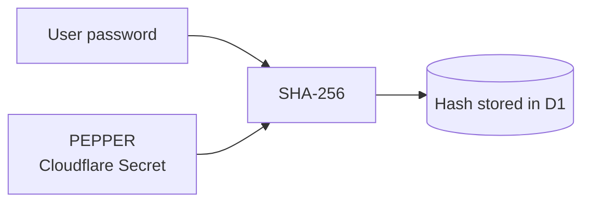
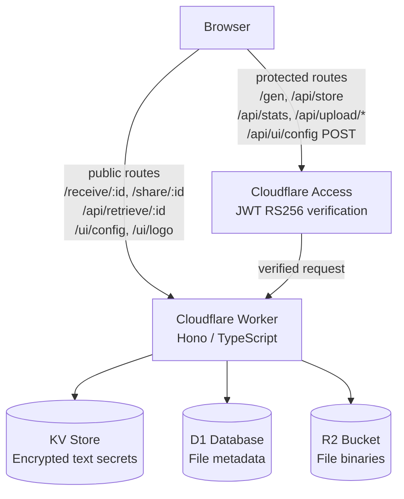

# Edge Secrets

Secure, one-time sharing of passwords, files and links — built on Cloudflare Workers.

## Features

| Feature | Details |
|---|---|
| **Text secrets** | Zero-knowledge credential sharing — AES-256-GCM, passphrase in URL hash, burn-on-read |
| **File sharing** | Up to 5 GB via R2, optional password, download limit, server-enforced TTL |
| **URL shortener** | Short links with TTL and click limit, SSRF-safe |
| **Appearance editor** | Accent colour, background colour, brand name, tagline, logo — all globally persistent |
| **Dark / light mode** | System-detected per client, manually overridable |
| **QR codes** | Server-rendered SVG QR on every output link — scan directly from desktop |
| **CF Access** | All write/admin endpoints protected by Cloudflare Access + RS256 JWT verification |

---

## How It Works

### Text Secrets (passwords, credentials)

Encryption happens **entirely in the browser**. The server never sees plaintext data or the encryption key.


**What the server knows:** encrypted bytes + a password verification hash.
**What the server never knows:** the content, the encryption key, or the passphrase itself.

#### Cryptography Details

| Element | Algorithm | Parameters |
|---|---|---|
| Key derivation | PBKDF2 | SHA-256, 100,000 iterations |
| Encryption | AES-GCM | 256-bit, random IV (12 B) |
| Password verifier | PBKDF2 | SHA-256, 50,000 iterations, salt `id + "_v"` |
| Link entropy (with passphrase) | 20-char key, 58-char alphabet | ~118 bits |

---

### Files

Files are **not client-side encrypted** — they go directly to R2. Protection is enforced through:


- Optional password (`SHA-256(password + PEPPER)` — verified server-side)
- Download limit (1×, 5×, or unlimited)
- Server-enforced TTL — maximum 7 days regardless of what the client sends
- Automatic deletion on expiry (hourly cron)
- Lockout after 3 failed password attempts → file deleted immediately

#### Global Pepper

File passwords are hashed as `SHA-256(password + PEPPER)`, where `PEPPER` is a global secret stored as a Cloudflare Secret (not in code, not in the repo). Even if the D1 database leaks, the password hashes are useless without the pepper.



The Worker refuses to start if `PEPPER` is not set (`bindings guard`).

---

## Security

| Measure | Description |
|---|---|
| **Burn-on-read** | Secret deleted from KV on first successful retrieval |
| **Rate limiting** | Max 3 attempts; permanent deletion on lockout (secrets & files) |
| **Global Pepper** | File password hashes include a server-side secret; D1 leak doesn't compromise passwords |
| **Server-side TTL cap** | Backend enforces maximum lifetime; client cannot exceed it |
| **CF Access + JWT verification** | Protected endpoints guarded at two layers: Cloudflare Access policy + in-Worker RS256 JWT verification against JWKS endpoint (cached 1 h) |
| **Security headers** | CSP, X-Frame-Options, X-Content-Type-Options, Referrer-Policy |
| **RFC 5987 filenames** | Safe percent-encoded `Content-Disposition` filenames (no header injection) |
| **No content logging** | Errors return generic messages — no `e.message` leakage |
| **Bindings guard** | Worker returns 500 on startup if any required binding is missing (DB, BUCKET, KV, PEPPER, CF_TEAM_DOMAIN, CF_AUD) |

---

## Architecture



| Resource | Usage |
|---|---|
| **KV** (`SECRETS_STORE`) | Encrypted text secrets + verifier, short links, global UI config (accent, bg, brand, tagline) |
| **D1** (`DB`) | File metadata (name, size, TTL, download count, password hash) |
| **R2** (`BUCKET`) | Raw file data (multipart upload up to 5 GB) + logo image |

---

## Stack

- **Runtime:** Cloudflare Workers
- **Framework:** [Hono](https://hono.dev) v4
- **Language:** TypeScript (strict)
- **Deploy tool:** Wrangler v4
- **QR codes:** [qrcode-generator](https://github.com/kazuhikoarase/qrcode-generator) — server-side SVG rendering

---

## API Endpoints

| Method | Path | Description | Access |
|---|---|---|---|
| `GET` | `/gen` | Secret & upload creation panel | 🔒 CF Access |
| `POST` | `/api/store` | Save encrypted secret to KV | 🔒 CF Access |
| `POST` | `/api/retrieve/:id` | Retrieve and burn secret | Public |
| `GET` | `/receive/:id` | Secret retrieval page | Public |
| `GET` | `/api/stats` | Storage statistics | 🔒 CF Access |
| `POST` | `/api/upload/init` | Initiate multipart upload | 🔒 CF Access |
| `PUT` | `/api/upload/part` | Upload file part | 🔒 CF Access |
| `POST` | `/api/upload/complete` | Finalize upload | 🔒 CF Access |
| `GET` | `/share/:id` | Download file | Public |
| `DELETE` | `/api/del/:id` | Delete file | Public* |
| `POST` | `/api/shorten` | Create short link (TTL + click limit) | 🔒 CF Access |
| `GET` | `/s/:id` | Redirect to target URL | Public |
| `GET` | `/ui/config` | Read global UI settings (accent, bg, brand, tagline) | Public |
| `POST` | `/api/ui/config` | Update global UI settings | 🔒 CF Access |
| `GET` | `/ui/logo` | Serve logo image from R2 | Public |
| `POST` | `/api/ui/logo` | Upload logo (PNG/SVG/WebP, max 256 KB) | 🔒 CF Access |
| `DELETE` | `/api/ui/logo` | Remove logo | 🔒 CF Access |
| `GET` | `/ui/qr` | Generate QR code SVG for a given URL (`?d=encodedUrl`) | Public |

> *`/api/del` is intentionally outside CF Access.
> `/ui/config` and `/ui/logo` (GET) live outside `/api/` so CF Access policies don't block public clients. Write operations (`POST /api/ui/*`, `DELETE /api/ui/*`) remain protected.

---

## Deploy

### 1. Clone and install

```bash
git clone https://github.com/maciekaz/edge-secrets
cd edge-secrets
npm install
```

### 2. Configure `wrangler.toml`

Copy the example config and fill in your values:

```bash
cp wrangler.example.toml wrangler.toml
```

`wrangler.toml` is git-ignored — your account ID and resource IDs stay local.

#### Create Cloudflare resources

```bash
# KV namespace
npx wrangler kv namespace create SECRETS_STORE
# → copy the returned id into wrangler.toml

# D1 database
npx wrangler d1 create secret-db
# → copy the returned database_id into wrangler.toml

# R2 bucket is auto-provisioned on first deploy
```

#### Initialize D1 schema

```bash
npx wrangler d1 execute secret-db --remote --command \
  "CREATE TABLE IF NOT EXISTS files (
    id TEXT PRIMARY KEY,
    filename TEXT NOT NULL,
    size INTEGER NOT NULL,
    created_at INTEGER NOT NULL,
    expires_at INTEGER NOT NULL,
    status TEXT NOT NULL DEFAULT 'pending',
    password_hash TEXT,
    max_downloads INTEGER NOT NULL DEFAULT 1,
    download_count INTEGER NOT NULL DEFAULT 0,
    failed_attempts INTEGER NOT NULL DEFAULT 0
  );"
```

### 3. Set Cloudflare Secrets

None of these go into the repo or `wrangler.toml`. The Worker won't start without all three.

```bash
# 1. Global pepper for file password hashes (generate a random one)
echo "$(openssl rand -base64 32)" | npx wrangler secret put PEPPER

# 2. Cloudflare Access team domain
npx wrangler secret put CF_TEAM_DOMAIN
# → e.g. yourteam.cloudflareaccess.com

# 3. Application Audience (AUD) tag
# Found at: CF Zero Trust → Access → Applications → (app) → Overview → AUD Tag
npx wrangler secret put CF_AUD
```

> Make sure you have a CF Zero Trust **Access Policy** configured for the protected paths: `/gen`, `/api/store`, `/api/stats`, `/api/upload`, `/api/shorten`, `/api/ui/config`, `/api/ui/logo`. Do **not** include `/ui/config`, `/ui/logo`, `/ui/qr`, or `/s/` — these must remain public.

### 4. Deploy

```bash
npx wrangler deploy
```

---

### Local Development

Create a `.dev.vars` file (git-ignored):

```ini
PEPPER=local-pepper-for-testing-only
CF_TEAM_DOMAIN=yourteam.cloudflareaccess.com
CF_AUD=your-aud-tag
```

> In local dev, requests don't go through CF Access — protected endpoints require a JWT passed manually via the `Cf-Access-Jwt-Assertion` header.

```bash
npx wrangler dev
# → http://localhost:8787
```
