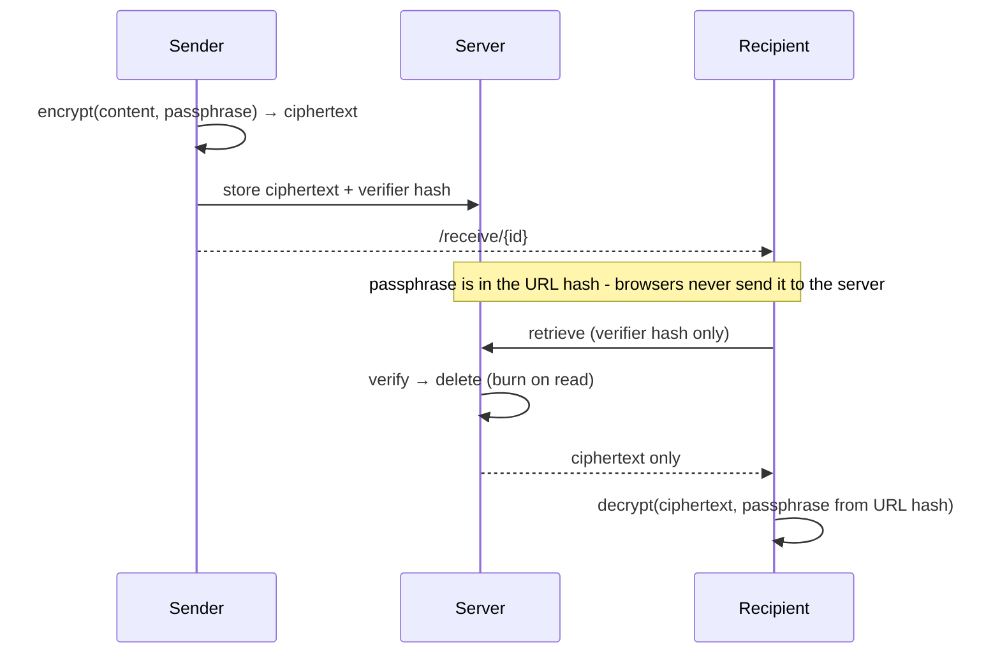
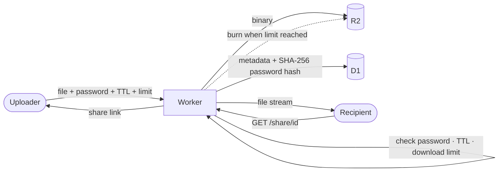
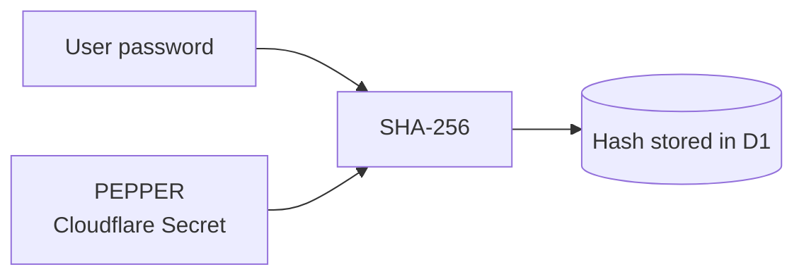
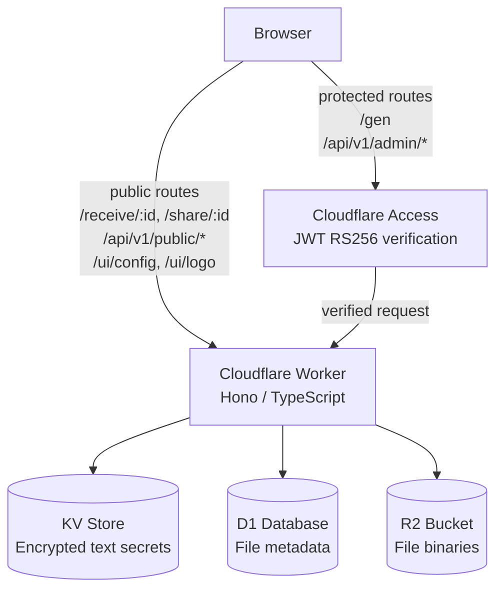

# Edge Secrets

Secure, one-time sharing of passwords, files and links - built on Cloudflare Workers.


## Quick deployment

[](https://deploy.workers.cloudflare.com/?url=https://github.com/maciekaz/edge-secrets)

(Read instructions at the end of this page!)

## Features

| Feature | Details |
|---|---|
| **Text secrets** | Zero-knowledge credential sharing - AES-256-GCM, passphrase in URL hash, burn-on-read |
| **File sharing** | Up to 5 GB via R2, optional password, download limit, server-enforced TTL |
| **URL shortener** | Short links with TTL and click limit, SSRF-safe |
| **Appearance editor** | Accent colour, background colour, brand name, tagline, logo - all globally persistent |
| **Dark / light mode** | System-detected per client, manually overridable |
| **QR codes** | Server-rendered SVG QR on every output link - scan directly from desktop |
| **CF Access** | All write/admin endpoints protected by Cloudflare Access + RS256 JWT verification |
| **Internationalisation** | 8 languages, auto-detected per user, flag picker in the UI |
| **REST API** | Versioned `/api/v1/` - admin zone (`/api/v1/admin/*`) protected by CF Access, public zone (`/api/v1/public/*`) open; full docs in [docs/api.md](docs/api.md) |

> **$0 to run.** The entire stack - Workers, KV, D1, R2, and Cloudflare Access (up to 50 users) - runs on Cloudflare's free tier. No credit card required, no infrastructure to manage. You only start paying if you exceed the free-tier request limits, which for a self-hosted internal tool is unlikely.

---

## Why Secrets on Edge?

Running a secrets tool on Cloudflare Workers is not just a cost decision - it changes what the tool can actually do.

**Globally fast, always.** Workers run in 300+ locations worldwide. Whether your recipient is in Warsaw, Singapore, or San Escobar, the secret is served from the nearest edge node - no single-region latency, no cold starts, no load balancers to manage.

**No servers, no attack surface.** There is no VM to patch, no open SSH port, no container to harden. The entire runtime is ephemeral and managed by Cloudflare. Your only security responsibility is the application code itself.

**Native CI/CD integration.** Because everything is behind a versioned REST API (`/api/v1/`), injecting secrets into pipelines is trivial. A GitHub Actions step, a GitLab CI job, or a shell script can push a one-time credential to a recipient without any human in the loop - authenticated via a Cloudflare Access service token, burned on first read which can be used also by machine.

**Scales to zero, scales to bursts.** Idle periods cost nothing. Traffic spikes are absorbed automatically by Cloudflare's infrastructure - no autoscaling groups, no capacity planning.

**Edge-native storage.** KV, D1, and R2 are co-located with the Worker. Secret retrieval, file streaming, and metadata lookups all happen without leaving the Cloudflare network.

---

## Internationalisation (i18n)

All UI text is managed in `src/i18n.ts` - a self-contained module with no external dependencies.

### Supported languages

| Code | Language |
|------|----------|
| `en` | English (default) |
| `pl` | Polski |
| `de` | Deutsch |
| `fr` | Français |
| `es` | Español |
| `uk` | Українська |
| `pt` | Português |
| `zh` | 中文 (Simplified) |
| `cs` | Čeština |


### How to add your own language

1. Open `src/i18n.ts`.
2. Add the new code to the `LangCode` union type:
   ```ts
   export type LangCode = 'en' | 'pl' | 'de' | 'fr' | 'es' | 'uk' | 'pt' | 'zh' | 'cs' | 'xx' 
   ```
3. Add a full `Translations` object under the new key in the `I18N` record (~95 keys).
4. Add an entry to `LANG_OPTIONS` in the same file:
   ```ts
   { code: 'xx', flag: '🇽🇽', name: 'Language name' }
   ```
5. Deploy - no other files need to change.
---

## How It Works

### Text Secrets (passwords, credentials)

Encryption happens **entirely in the browser**. The server never sees plaintext data or the encryption key.



**What the server knows:** encrypted bytes + a password verification hash.
**What the server never knows:** the content, the encryption key, or the passphrase itself.

#### Cryptography Details

| Element | Algorithm | Parameters |
|---|---|---|
| Key derivation | PBKDF2 | SHA-256, 100,000 iterations |
| Encryption | AES-GCM | 256-bit, random IV (12 B) |
| Password verifier | PBKDF2 | SHA-256, 50,000 iterations, salt `id + "_v"` |
| Link entropy (with passphrase) | 20-char key, 58-char alphabet | ~118 bits |

---

### Files

Files are **not client-side encrypted** - they go directly to R2. Protection is enforced through:



- Optional password (`SHA-256(password + PEPPER)` - verified server-side)
- Download limit (1×, 5×, or unlimited)
- Server-enforced TTL - maximum 7 days regardless of what the client sends
- Automatic deletion on expiry (hourly cron)
- Lockout after 3 failed password attempts → file deleted immediately

#### Global Pepper

File passwords are hashed as `SHA-256(password + PEPPER)`, where `PEPPER` is a global secret stored as a Cloudflare Secret (not in code, not in the repo). Even if the D1 database leaks, the password hashes are useless without the pepper.



The Worker refuses to start if `PEPPER` is not set (`bindings guard`).

---

## Security

| Measure | Description |
|---|---|
| **Burn-on-read** | Secret deleted from KV on first successful retrieval |
| **Rate limiting** | Max 3 attempts; permanent deletion on lockout (secrets & files) |
| **Global Pepper** | File password hashes include a server-side secret; D1 leak doesn't compromise passwords |
| **Server-side TTL cap** | Backend enforces maximum lifetime; client cannot exceed it |
| **CF Access + JWT verification** | Protected endpoints guarded at two layers: Cloudflare Access policy + in-Worker RS256 JWT verification against JWKS endpoint (cached 1 h) |
| **Security headers** | CSP, X-Frame-Options, X-Content-Type-Options, Referrer-Policy |
| **RFC 5987 filenames** | Safe percent-encoded `Content-Disposition` filenames (no header injection) |
| **No content logging** | Errors return generic messages - no `e.message` leakage |
| **Bindings guard** | Worker returns 500 on startup if any required binding is missing (DB, BUCKET, KV, PEPPER, CF_TEAM_DOMAIN, CF_AUD) |
| **Turnstile** | Optional Cloudflare Turnstile (managed challenge) on secret retrieval and file downloads - blocks bots and brute-force before any KV/D1/R2 access; token bound to visitor IP via `remoteip`; failed challenge never increments the attempt counter. See [docs/turnstile.md](docs/turnstile.md). |

---

## Architecture



| Resource | Usage |
|---|---|
| **KV** (`SECRETS_STORE`) | Encrypted text secrets + verifier, short links, global UI config (accent, bg, brand, tagline) |
| **D1** (`DB`) | File metadata (name, size, TTL, download count, password hash) |
| **R2** (`BUCKET`) | Raw file data (multipart upload up to 5 GB) + logo image |

---

## Stack

- **Runtime:** Cloudflare Workers
- **Framework:** [Hono](https://hono.dev) v4
- **Language:** TypeScript (strict)
- **Deploy tool:** Wrangler v4
- **QR codes:** [qrcode-generator](https://github.com/kazuhikoarase/qrcode-generator) - server-side SVG rendering

---

## API Endpoints

API endpoints are grouped under `/api/v1/` in two zones. Cloudflare Access needs only **two rules**: `/gen` and `/api/v1/admin/*`.

### Admin Zone - `/api/v1/admin/` (🔒 CF Access)

| Method | Path | Description |
|---|---|---|
| `GET` | `/gen` | Secret & upload creation panel |
| `POST` | `/api/v1/admin/secrets` | Save encrypted secret to KV |
| `GET` | `/api/v1/admin/stats` | Storage statistics + file list |
| `POST` | `/api/v1/admin/files/init` | Initiate multipart upload |
| `PUT` | `/api/v1/admin/files/part` | Upload file part |
| `POST` | `/api/v1/admin/files/complete` | Finalize upload |
| `POST` | `/api/v1/admin/links` | Create short link (TTL + click limit) |
| `POST` | `/api/v1/admin/ui/config` | Update global UI settings |
| `POST` | `/api/v1/admin/ui/turnstile` | Update Turnstile settings |
| `POST` | `/api/v1/admin/ui/logo` | Upload logo (PNG/SVG/WebP, max 256 KB) |
| `DELETE` | `/api/v1/admin/ui/logo` | Remove logo |

### Public Zone - `/api/v1/public/` (No auth)

| Method | Path | Description |
|---|---|---|
| `POST` | `/api/v1/public/secrets/:id/retrieve` | Retrieve and burn secret |
| `DELETE` | `/api/v1/public/files/:id` | Delete file (uploader self-service) |

### Public UI Routes (No auth)

| Method | Path | Description |
|---|---|---|
| `GET` | `/receive/:id` | Secret retrieval page |
| `GET` | `/share/:id` | File download / Turnstile gate |
| `GET` | `/s/:id` | Redirect to target URL |
| `GET` | `/ui/config` | Read global UI settings (accent, bg, brand, tagline) |
| `GET` | `/ui/logo` | Serve logo image from R2 |
| `GET` | `/ui/qr` | Generate QR code SVG for a given URL (`?d=encodedUrl`) |

> Full request/response documentation: [docs/api.md](docs/api.md)
>
> `/api/v1/public/files/:id` (DELETE) is intentionally outside CF Access - used by the uploader to self-revoke a link.
> `/ui/config` and `/ui/logo` (GET) are outside `/api/v1/` so CF Access policies don't block public clients.

---
## Quick deploy

[](https://deploy.workers.cloudflare.com/?url=https://github.com/maciekaz/edge-secrets)

Deploy with one click, then complete the required post-deploy setup below.

### Post-deploy required steps

1. Create/bind Cloudflare resources:
   - KV namespace: `SECRETS_STORE`
   - D1 database: `DB`
   - R2 bucket: `BUCKET`

2. Initialize D1 schema (table: `files`).

3. Set required Worker secrets:
   - `PEPPER`
   - `CF_TEAM_DOMAIN`
   - `CF_AUD`
   - Optional: `TURNSTILE_SECRET`

4. Configure Cloudflare Access policies for:
   - `/gen`
   - `/api/v1/admin/*`

5. Keep these routes public (no Access policy):
   - `/api/v1/public/*`
   - `/ui/config`
   - `/ui/logo`
   - `/ui/qr`
   - `/s/*`

6. Deploy and verify:
   - Open `/gen` (protected)
   - Open `/receive/:id` and `/share/:id` (public)
  
   
## Another way of deployment

### 1. Clone and install

```bash
git clone https://github.com/maciekaz/edge-secrets
cd edge-secrets
npm install
```

### 2. Configure `wrangler.toml`

Copy the example config and fill in your values:

```bash
cp wrangler.example.toml wrangler.toml
```

`wrangler.toml` is git-ignored - your account ID and resource IDs stay local.

#### Create Cloudflare resources

```bash
# KV namespace
npx wrangler kv namespace create SECRETS_STORE
# → copy the returned id into wrangler.toml

# D1 database
npx wrangler d1 create secret-db
# → copy the returned database_id into wrangler.toml

# R2 bucket is auto-provisioned on first deploy
```

#### Initialize D1 schema

```bash
npx wrangler d1 execute secret-db --remote --command \
  "CREATE TABLE IF NOT EXISTS files (
    id TEXT PRIMARY KEY,
    filename TEXT NOT NULL,
    size INTEGER NOT NULL,
    created_at INTEGER NOT NULL,
    expires_at INTEGER NOT NULL,
    status TEXT NOT NULL DEFAULT 'pending',
    password_hash TEXT,
    max_downloads INTEGER NOT NULL DEFAULT 1,
    download_count INTEGER NOT NULL DEFAULT 0,
    failed_attempts INTEGER NOT NULL DEFAULT 0
  );"
```

### 3. Set Cloudflare Secrets

None of these go into the repo or `wrangler.toml`. The Worker won't start without the first three.

```bash
# 1. Global pepper for file password hashes (generate a random one)
echo "$(openssl rand -base64 32)" | npx wrangler secret put PEPPER

# 2. Cloudflare Access team domain
npx wrangler secret put CF_TEAM_DOMAIN
# → e.g. yourteam.cloudflareaccess.com

# 3. Application Audience (AUD) tag
# Found at: CF Zero Trust → Access → Applications → (app) → Overview → AUD Tag
npx wrangler secret put CF_AUD

# 4. Turnstile secret key (optional - only if you want bot protection)
# Found at: Cloudflare Dashboard → Turnstile → your site → Secret Key
npx wrangler secret put TURNSTILE_SECRET
```

> If `TURNSTILE_SECRET` is not set, Turnstile is silently disabled even if the KV toggles are on - no lockout, no errors.

> Make sure you have a CF Zero Trust **Access Policy** configured for only **two paths**: `/gen` and `/api/v1/admin/*`. Do **not** include `/ui/config`, `/ui/logo`, `/ui/qr`, `/s/`, or `/api/v1/public/*` - these must remain public.

### 4. Deploy

```bash
npx wrangler deploy
```

> **Cron trigger** - the hourly cleanup job (`0 * * * *`) is already defined in `wrangler.toml` and is deployed automatically with the command above. No manual setup needed. It deletes expired files from R2 and D1 every hour. You can verify it was registered under **Workers & Pages → your worker → Triggers** in the Cloudflare dashboard.

---

### Local Development

Create a `.dev.vars` file (git-ignored):

```ini
PEPPER=local-pepper-for-testing-only
CF_TEAM_DOMAIN=yourteam.cloudflareaccess.com
CF_AUD=your-aud-tag

# Optional - use Cloudflare's always-pass test key for local Turnstile testing
TURNSTILE_SECRET=1x0000000000000000000000000000000AA
```

> In local dev, requests don't go through CF Access - protected endpoints require a JWT passed manually via the `Cf-Access-Jwt-Assertion` header.

```bash
npx wrangler dev
# → http://localhost:8787
```
