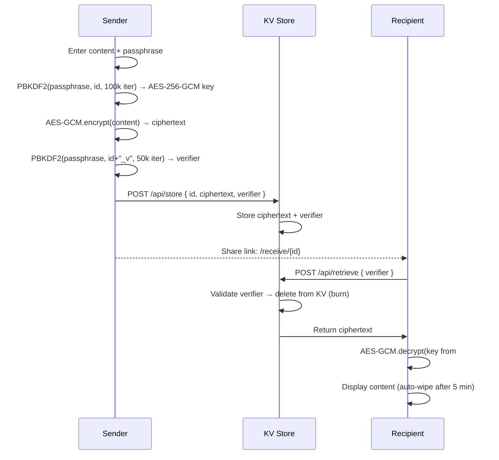
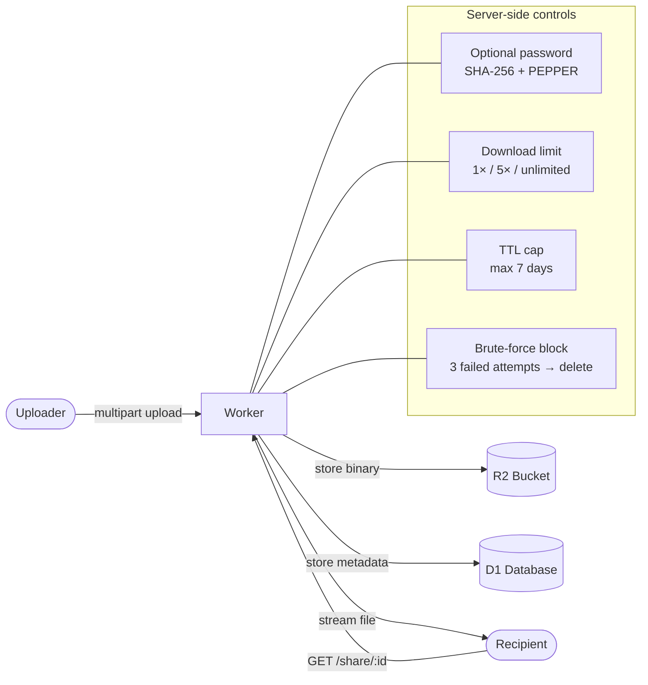
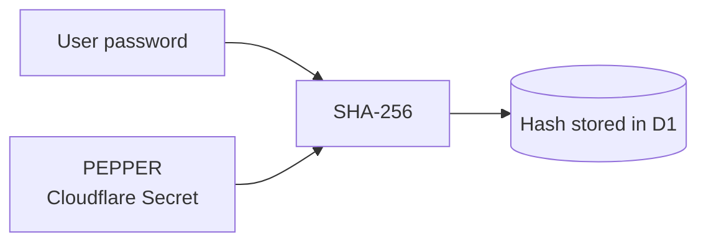
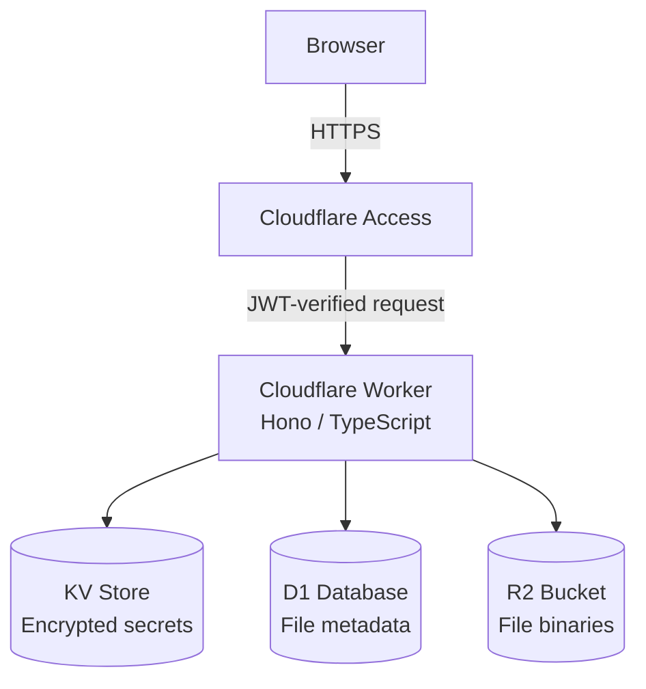

# Edge Secrets

Secure, one-time sharing of passwords and files — built on Cloudflare Workers.

---

## How It Works

### Text Secrets (passwords, credentials)

Encryption happens **entirely in the browser**. The server never sees plaintext data or the encryption key.



**What the server knows:** encrypted bytes + a password verification hash.
**What the server never knows:** the content, the encryption key, or the passphrase itself.

#### Cryptography Details

| Element | Algorithm | Parameters |
|---|---|---|
| Key derivation | PBKDF2 | SHA-256, 100,000 iterations |
| Encryption | AES-GCM | 256-bit, random IV (12 B) |
| Password verifier | PBKDF2 | SHA-256, 50,000 iterations, salt `id + "_v"` |
| Link entropy (with passphrase) | 20-char key, 58-char alphabet | ~118 bits |

---

### Files

Files are **not client-side encrypted** — they go directly to R2. Protection is enforced through:



- Optional password (`SHA-256(password + PEPPER)` — verified server-side)
- Download limit (1×, 5×, or unlimited)
- Server-enforced TTL — maximum 7 days regardless of what the client sends
- Automatic deletion on expiry (hourly cron)
- Lockout after 3 failed password attempts → file deleted immediately

#### Global Pepper

File passwords are hashed as `SHA-256(password + PEPPER)`, where `PEPPER` is a global secret stored as a Cloudflare Secret (not in code, not in the repo). Even if the D1 database leaks, the password hashes are useless without the pepper.



The Worker refuses to start if `PEPPER` is not set (`bindings guard`).

---

## Security

| Measure | Description |
|---|---|
| **Burn-on-read** | Secret deleted from KV on first successful retrieval |
| **Rate limiting** | Max 3 attempts; permanent deletion on lockout (secrets & files) |
| **Global Pepper** | File password hashes include a server-side secret; D1 leak doesn't compromise passwords |
| **Server-side TTL cap** | Backend enforces maximum lifetime; client cannot exceed it |
| **CF Access + JWT verification** | Protected endpoints guarded at two layers: Cloudflare Access policy + in-Worker RS256 JWT verification against JWKS endpoint (cached 1 h) |
| **Security headers** | CSP, X-Frame-Options, X-Content-Type-Options, Referrer-Policy |
| **RFC 5987 filenames** | Safe percent-encoded `Content-Disposition` filenames (no header injection) |
| **No content logging** | Errors return generic messages — no `e.message` leakage |
| **Bindings guard** | Worker returns 500 on startup if any required binding is missing (DB, BUCKET, KV, PEPPER, CF_TEAM_DOMAIN, CF_AUD) |

---

## Architecture



| Resource | Usage |
|---|---|
| **KV** (`SECRETS_STORE`) | Encrypted text secrets + verifier, TTL 1–72 h |
| **D1** (`DB`) | File metadata (name, size, TTL, download count, password hash) |
| **R2** (`BUCKET`) | Raw file data, multipart upload up to 5 GB |

---

## Stack

- **Runtime:** Cloudflare Workers
- **Framework:** [Hono](https://hono.dev) v4
- **Language:** TypeScript (strict)
- **Deploy tool:** Wrangler v4

---

## API Endpoints

| Method | Path | Description | Access |
|---|---|---|---|
| `GET` | `/gen` | Secret & upload creation panel | 🔒 CF Access |
| `POST` | `/api/store` | Save encrypted secret to KV | 🔒 CF Access |
| `POST` | `/api/retrieve/:id` | Retrieve and burn secret | Public |
| `GET` | `/receive/:id` | Secret retrieval page | Public |
| `GET` | `/api/stats` | Storage statistics | 🔒 CF Access |
| `POST` | `/api/upload/init` | Initiate multipart upload | 🔒 CF Access |
| `PUT` | `/api/upload/part` | Upload file part | 🔒 CF Access |
| `POST` | `/api/upload/complete` | Finalize upload | 🔒 CF Access |
| `GET` | `/share/:id` | Download file | Public |
| `DELETE` | `/api/del/:id` | Delete file | Public* |

> *`/api/del` is intentionally outside CF Access.

---

## Deploy

```bash
npm install
npx wrangler deploy
```

### Required `wrangler.toml` Bindings

```toml
[[kv_namespaces]]
binding = "SECRETS_STORE"
id = "<KV_NAMESPACE_ID>"

[[d1_databases]]
binding = "DB"
database_name = "<D1_DATABASE_NAME>"
database_id = "<D1_DATABASE_ID>"

[[r2_buckets]]
binding = "BUCKET"
bucket_name = "<R2_BUCKET_NAME>"
```

### Required Cloudflare Secrets

None of these go into the repo or `wrangler.toml`. The Worker won't start without all three.

```bash
# 1. Global pepper for file password hashes
openssl rand -base64 32
npx wrangler secret put PEPPER

# 2. Cloudflare Access team domain
npx wrangler secret put CF_TEAM_DOMAIN
# → e.g. yourteam.cloudflareaccess.com

# 3. Application Audience (AUD) tag
# Found at: CF Zero Trust → Access → Applications → (app) → Overview → AUD Tag
npx wrangler secret put CF_AUD
```

> **Note:** `CF_AUD` is unique per CF Access application. Without it, JWT verification always returns 401. Make sure you also have an **Access Policy** configured in CF Zero Trust for the protected paths (`/gen`, `/api/store`, `/api/stats`, `/api/upload`).

### Local Development

Create a `.dev.vars` file (git-ignored):

```ini
PEPPER=local-pepper-for-testing-only
CF_TEAM_DOMAIN=yourteam.cloudflareaccess.com
CF_AUD=your-aud-tag
```

> In local dev, requests don't go through CF Access — protected endpoints require a JWT passed manually via the `Cf-Access-Jwt-Assertion` header.

```bash
npx wrangler dev
# → http://localhost:8787
```
