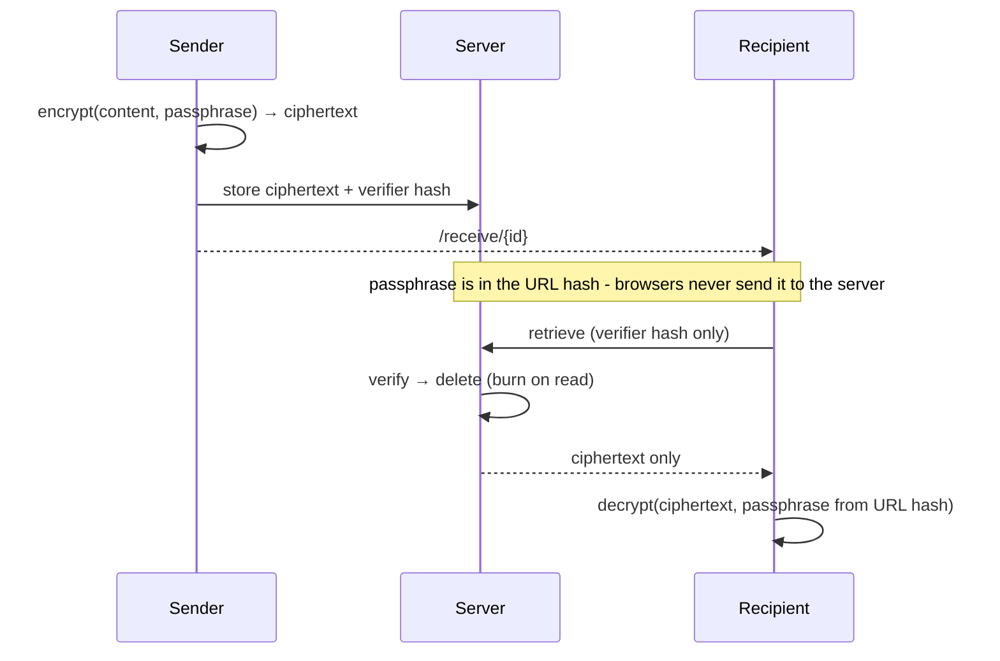
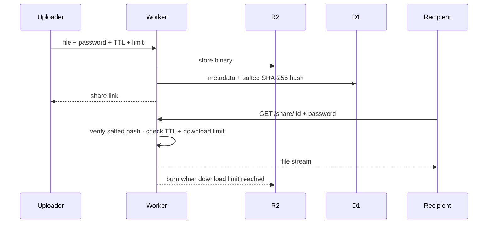
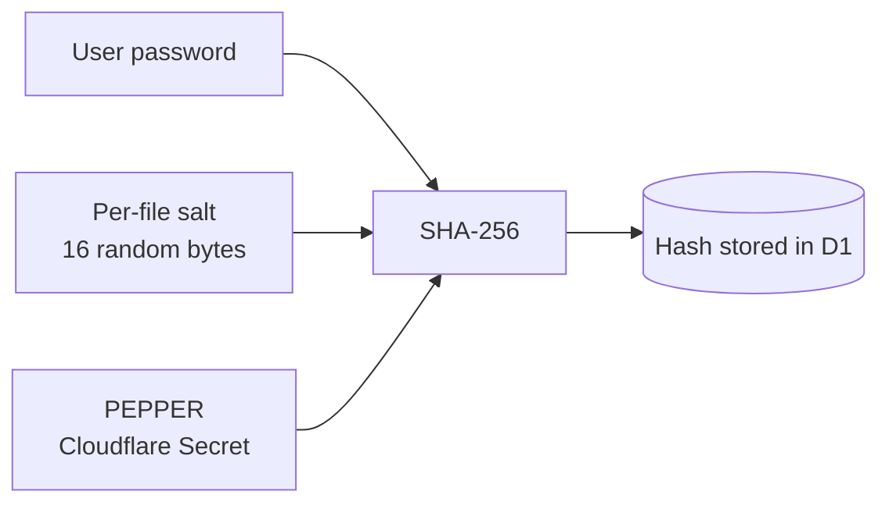
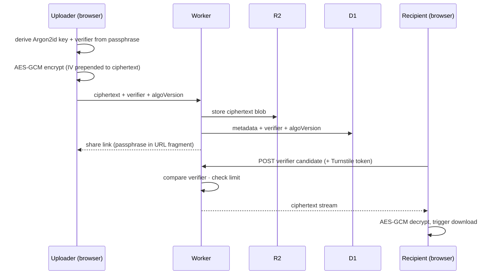
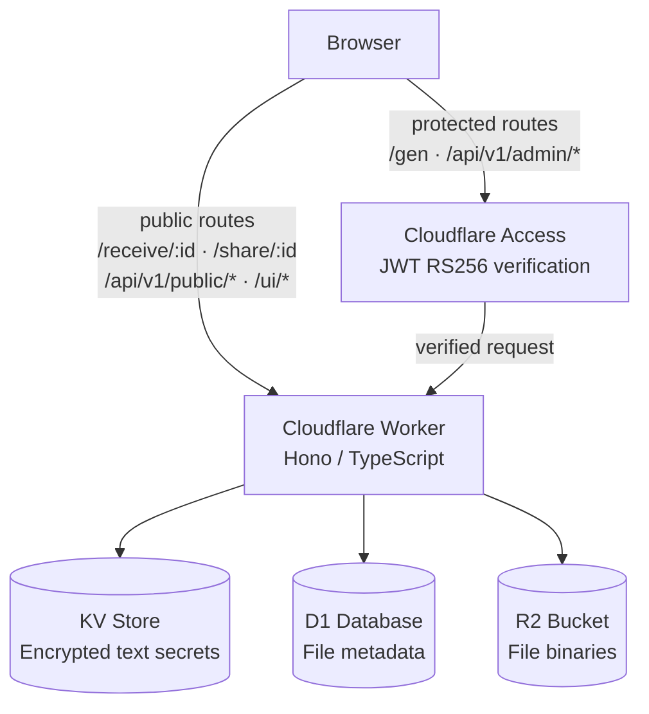

# Edge Secrets

Secure, one-time sharing of passwords, files and links - built on Cloudflare Workers.


## Quick deployment

[](https://deploy.workers.cloudflare.com/?url=https://github.com/maciekaz/edge-secrets)

(Read instructions at the end of this page!)

## Features

| Feature | Details |
|---|---|
| **Text secrets** | Zero-knowledge credential sharing - AES-256-GCM, Argon2id key derivation (OWASP 2023), passphrase in URL hash, burn-on-read |
| **File sharing** | R2-backed, per-file and total caps admin-configurable in Appearance (defaults 9 GB / 9.5 GB, hard ceiling 50 GB), optional password, download limit, server-enforced TTL |
| **🆕 E2EE file sharing** | Opt-in client-side AES-GCM + Argon2id for files up to 150 MiB. Server stores ciphertext only; passphrase travels in the URL fragment (or out-of-band) and never hits the server |
| **URL shortener** | Short links with TTL and click limit, SSRF-safe, unbiased ID generation |
| **Appearance editor** | Accent colour, background colour, brand name, tagline, logo, storage limits - all globally persistent |
| **Dark / light mode** | System-detected per client, manually overridable |
| **Drag-and-drop** | Full-screen dim overlay on the files tab; drops a file straight into the upload form |
| **QR codes** | Server-rendered SVG QR on every output link - scan directly from desktop |
| **CF Access** | All write/admin endpoints protected by Cloudflare Access + RS256 JWT verification |
| **Internationalisation** | 9 languages, auto-detected per user, flag picker in the UI |
| **REST API** | Versioned `/api/v1/` - admin zone (`/api/v1/admin/*`) protected by CF Access, public zone (`/api/v1/public/*`) open; full docs in [docs/api.md](docs/api.md) |

> **$0 to run.** The entire stack - Workers, KV, D1, R2, and Cloudflare Access (up to 50 users) - runs on Cloudflare's free tier. No credit card required, no infrastructure to manage. You only start paying if you exceed the free-tier request limits, which for a self-hosted internal tool is unlikely.

---

## Why Secrets on Edge?

Running a secrets tool on Cloudflare Workers is not just a cost decision - it changes what the tool can actually do.

**Globally fast, always.** Workers run in 300+ locations worldwide. Whether your recipient is in Warsaw, Singapore, or San Escobar, the secret is served from the nearest edge node - no single-region latency, no cold starts, no load balancers to manage.

**No servers, no attack surface.** There is no VM to patch, no open SSH port, no container to harden. The entire runtime is ephemeral and managed by Cloudflare. Your only security responsibility is the application code itself.

**Native CI/CD integration.** Because everything is behind a versioned REST API (`/api/v1/`), injecting secrets into pipelines is trivial. A GitHub Actions step, a GitLab CI job, or a shell script can push a one-time credential to a recipient without any human in the loop - authenticated via a Cloudflare Access service token, burned on first read which can be used also by machine.

**Scales to zero, scales to bursts.** Idle periods cost nothing. Traffic spikes are absorbed automatically by Cloudflare's infrastructure - no autoscaling groups, no capacity planning.

**Edge-native storage.** KV, D1, and R2 are co-located with the Worker. Secret retrieval, file streaming, and metadata lookups all happen without leaving the Cloudflare network.

---

## Internationalisation (i18n)

All UI text is managed in `src/i18n.ts` - a self-contained module with no external dependencies.

### Supported languages

| Code | Language |
|------|----------|
| `en` | English (default) |
| `pl` | Polski |
| `de` | Deutsch |
| `fr` | Français |
| `es` | Español |
| `uk` | Українська |
| `pt` | Português |
| `zh` | 中文 (Simplified) |
| `cs` | Čeština |


### How to add your own language

1. Open `src/i18n.ts`.
2. Add the new code to the `LangCode` union type:
   ```ts
   export type LangCode = 'en' | 'pl' | 'de' | 'fr' | 'es' | 'uk' | 'pt' | 'zh' | 'cs' | 'xx' 
   ```
3. Add a full `Translations` object under the new key in the `I18N` record (~95 keys).
4. Add an entry to `LANG_OPTIONS` in the same file:
   ```ts
   { code: 'xx', flag: '🇽🇽', name: 'Language name' }
   ```
5. Deploy - no other files need to change.
---

## How It Works

### Text Secrets (passwords, credentials)

Encryption happens **entirely in the browser**. The server never sees plaintext data or the encryption key.


```mermaid
sequenceDiagram
    participant S as Sender
    participant Server
    participant R as Recipient

    S->>S: encrypt(content, passphrase) → ciphertext
    S->>Server: store ciphertext + verifier hash
    S-->>R: /receive/{id}#passphrase

    Note over Server,R: passphrase is in the URL hash - browsers never send it to the server

    R->>Server: retrieve (verifier hash only)
    Server->>Server: verify → delete (burn on read)
    Server-->>R: ciphertext only

    R->>R: decrypt(ciphertext, passphrase from URL hash)
```

**What the server knows:** encrypted bytes + a password verification hash.
**What the server never knows:** the content, the encryption key, or the passphrase itself.

#### Cryptography Details

| Element | Algorithm | Parameters |
|---|---|---|
| Key derivation | Argon2id | m=19 MiB, t=2, p=1, 32-byte output (OWASP 2023 minimum) |
| Encryption | AES-GCM | 256-bit, random IV (12 B) |
| Password verifier | Argon2id | Same params, salt `id + "_v"` |
| Link entropy (with passphrase) | 20-char key, 58-char alphabet | ~118 bits |

**Why Argon2id:** PBKDF2 is GPU-friendly - a single RTX 4090 can try ~100-200 guesses/s against each stored verifier. Argon2id is memory-hard (19 MiB per hash), which forces attackers to trade GPU parallelism for memory bandwidth and drops the same attack to ~1-10 guesses/s per GPU. It won the 2015 Password Hashing Competition and is the OWASP and NIST default for new systems.

**Delivery:** the Argon2id WebAssembly implementation ([hash-wasm](https://www.npmjs.com/package/hash-wasm)) is bundled into the Worker and served at `/ui/argon2.v1.js` - same-origin only, `immutable` cached. No external CDN. The Worker itself never runs Argon2id: key derivation stays client-side, so the ~300-500 ms (desktop) / ~2-3 s (mobile) cost is the browser's, not the Worker's CPU budget.

**Versioned verifier:** each stored secret carries an `algoVersion` field in its KV metadata. This lets a future `argon2id-v2` (stronger params) roll out without breaking in-flight secrets - the client derives with whatever algo the server says the record was written with.

---

### Files

Files have two independent modes, chosen per-upload via a toggle on `/gen` → Files:

| Mode | When to use | Trust model |
|---|---|---|
| **Normal** (default) | Automation, large files up to 50 GB, cases where server-visible content is acceptable | Server has access to the plaintext blob; password (if set) gates retrieval via `SHA-256(pwd + salt + PEPPER)` |
| **End-to-end encrypted** | Sensitive content that must never touch the server in cleartext; max 150 MiB | Client encrypts with AES-GCM before upload; server stores ciphertext and an Argon2id verifier; no key material ever reaches the server |

#### Normal (server-visible) flow


```mermaid
sequenceDiagram
    participant U as Uploader
    participant W as Worker
    participant R2 as R2
    participant D1 as D1
    participant R as Recipient

    U->>W: file + password + TTL + limit
    W->>R2: store binary
    W->>D1: metadata + salted SHA-256 hash
    W-->>U: share link

    R->>W: GET /share/:id + password
    W->>W: verify salted hash · check TTL + download limit
    W-->>R: file stream
    W-->>R2: burn when download limit reached
```

- Optional password hashed as `SHA-256(password + per-file salt + PEPPER)` with constant-time comparison — each row gets its own 16-byte random salt so identical passwords across files never collide, and timing cannot leak how close a guess was
- Download limit (1×, 5×, or unlimited)
- Server-enforced TTL - maximum 7 days regardless of what the client sends
- Automatic deletion on expiry (hourly cron)
- Lockout after 3 failed password attempts → file deleted immediately. The counter increments atomically (`UPDATE … RETURNING`) so parallel guesses cannot race past the 3-try cap
- Per-file and total storage caps admin-configurable (defaults 9 GB / 9.5 GB, hard ceiling 50 GB per value) — any value above the 10 GiB Cloudflare R2 free tier requires typing `OKAY` to confirm in the Appearance panel
- After multipart upload completes the server re-reads the R2 object's actual size and rejects the upload if it does not match the size declared at init — blocks a declare-1-byte-upload-200-MB cap bypass

#### Global Pepper

File passwords are hashed as `SHA-256(password + PEPPER)`, where `PEPPER` is a global secret stored as a Cloudflare Secret (not in code, not in the repo). Even if the D1 database leaks, the password hashes are useless without the pepper.


```mermaid
flowchart LR
    P[User password] --> H[SHA-256]
    S[Per-file salt<br/>16 random bytes] --> H
    K[PEPPER<br/>Cloudflare Secret] --> H
    H --> DB[(Hash stored in D1)]
```

The Worker refuses to start if `PEPPER` is not set (`bindings guard`).

#### End-to-end encrypted flow (opt-in)

When the uploader flips the **End-to-End Encryption** toggle on the files tab, the file never leaves the browser unencrypted:


```mermaid
sequenceDiagram
    participant U as Uploader (browser)
    participant W as Worker
    participant R2 as R2
    participant D1 as D1
    participant R as Recipient (browser)

    U->>U: derive Argon2id key + verifier from passphrase
    U->>U: AES-GCM encrypt (IV prepended to ciphertext)
    U->>W: ciphertext + verifier + algoVersion
    W->>R2: store ciphertext blob
    W->>D1: metadata + verifier + algoVersion
    W-->>U: share link (passphrase in URL fragment)

    R->>W: POST verifier candidate (+ Turnstile token)
    W->>W: compare verifier · check limit
    W-->>R: ciphertext stream
    R->>R: AES-GCM decrypt, trigger download
```

| Element | Algorithm | Parameters |
|---|---|---|
| Key derivation | Argon2id | m=19 MiB, t=2, p=1, 32-byte output (OWASP 2023 minimum) |
| Salt | File UUID (for AES key) / UUID + `"_v"` (for verifier) | 36 bytes |
| Encryption | AES-GCM | 256-bit, random 12-byte IV prepended to the ciphertext blob |
| Verifier | Argon2id output, 32 bytes | Stored base64 in D1, checked via `safeCompare` |

**Constraints and trade-offs:**

- **150 MiB hard cap** on E2EE uploads. AES-GCM in the browser is one-shot (no streaming), so the full plaintext + ciphertext must coexist in RAM — ~300 MB peak for a 150 MB file, which is the ceiling we can rely on for mid-range mobile.
- **Passphrase is irrecoverable.** Losing it means the file is permanently unreadable. The server has no way to help — it never sees the passphrase or the key.
- **Independent Turnstile toggle.** `ui:turnstile_files_e2ee` in KV can force a challenge on E2EE downloads without touching the normal-files toggle, which is often left off to keep automation working.
- **Server trust minimised.** The server stores only the ciphertext, the Argon2id verifier, and the `algoVersion`. A full D1 + R2 leak produces no plaintext.

---

## Security

| Measure | Description |
|---|---|
| **Burn-on-read** | Secret deleted from KV on first successful retrieval |
| **Rate limiting** | Max 3 attempts; permanent deletion on lockout (secrets & files). File counter increments atomically (`UPDATE … RETURNING`) so parallel requests cannot race past the cap |
| **TTL preservation** | Failed verifier attempts bump the counter but preserve the secret's original expiration — an attacker cannot keep a short-TTL record alive indefinitely by stopping before the 3rd attempt. Secrets with <60 s remaining are burned instead of refreshed |
| **Upload size verification** | After multipart complete, the server compares the actual R2 object size against the value declared at init and drops the upload on mismatch. Blocks a declared-small / uploaded-large cap bypass |
| **Per-file password salt** | File passwords hashed with a per-row random 16-byte salt (`SHA-256(pwd | salt | PEPPER)`), constant-time compared — identical passwords across different files never produce the same digest |
| **Client-encrypted files (E2EE)** | Opt-in per upload. AES-GCM + Argon2id client-side, server never sees plaintext or key material. Independent Turnstile toggle (`ui:turnstile_files_e2ee`) so a managed challenge can be forced on E2EE downloads without breaking automation on the normal flow |
| **Global Pepper** | File password hashes include a server-side secret; D1 leak doesn't compromise passwords |
| **Server-side TTL cap** | Backend enforces maximum lifetime; client cannot exceed it |
| **CF Access + JWT verification** | Protected endpoints guarded at two layers: Cloudflare Access policy + in-Worker RS256 JWT verification against JWKS endpoint (cached 1 h) |
| **Security headers** | HSTS (1-year, preloadable), X-Frame-Options `DENY`, X-Content-Type-Options `nosniff`, Referrer-Policy `no-referrer`, Cross-Origin-Opener-Policy `same-origin`, Cross-Origin-Resource-Policy `same-origin`, explicit Permissions-Policy denying every permission-gated API we don't use |
| **Content-Security-Policy (strict)** | No `'unsafe-inline'` on `script-src`, no `'unsafe-eval'`, no external script origins beyond Cloudflare Turnstile. All page JS is delivered from `/ui/app.v1.js` (same-origin, bundled). Per-page data (i18n, page context) ships in `<script type="application/json">` data islands that the browser stores but never executes. Event handlers use `data-action` attributes dispatched by a single delegating listener — no `onclick=` attributes anywhere. A stored XSS (even one that slipped past escapeHtml) cannot execute because inline script is categorically forbidden |
| **RFC 5987 filenames** | Safe percent-encoded `Content-Disposition` filenames (no header injection) |
| **No content logging** | Errors return generic messages - no `e.message` leakage |
| **Bindings guard** | Worker returns 500 on startup if any required binding is missing (DB, BUCKET, KV, PEPPER, CF_TEAM_DOMAIN, CF_AUD) |
| **Turnstile** | Optional Cloudflare Turnstile (managed challenge) on secret retrieval and file downloads - blocks bots and brute-force before any KV/D1/R2 access; token bound to visitor IP via `remoteip`; failed challenge never increments the attempt counter. See [docs/turnstile.md](docs/turnstile.md). |

### Audited

Every release goes through the layered toolchain below before it is cut. Findings from each stage are triaged and either fixed in the same commit, documented as accepted risk, or suppressed with a reasoned `.snyk` / inline ignore. The live site is re-audited on every push to `master`.

| Layer | Tool | What it catches | How it's run |
|---|---|---|---|
| **Dependency vulnerabilities** | [Snyk Open Source (SCA)](https://snyk.io/product/open-source-security-management/) | Known CVEs in `hono`, `hash-wasm`, `wrangler`, `qrcode-generator` and their transitive deps | `snyk_sca_scan` on every commit; currently 0 issues |
| **Static code analysis** | [Snyk Code](https://snyk.io/product/snyk-code/) + [Semgrep](https://semgrep.dev) with `p/typescript`, `p/javascript`, `p/owasp-top-ten`, `p/security-audit`, `p/xss`, `p/command-injection` rulesets | SAST — insecure patterns, taint analysis, OWASP Top 10 classes | `semgrep scan` locally before each deploy; currently 0 true positives |
| **Architectural & threat-model review** | [Anthropic Claude Opus 4.7](https://www.anthropic.com/) | Cross-cutting design flaws a rule-based scanner does not see — trust-boundary breaches, endpoint scope / auth gaps, race conditions, protocol misuse between crypto primitives, key / salt reuse, UX flows that silently bypass a control. Used strictly as a reviewer of structure, not as an orchestrator of other tools | Pre-release code walk-through against the full `src/index.ts`, scoped brief to zero-trust invariants and the E2EE boundary |
| **Dynamic scanning (DAST)** | [OWASP ZAP 2.17.0](https://www.zaproxy.org), seeded with every public endpoint (`/receive/:id`, `/share/:id`, `/s/:id`, `/ui/*`) | Active scan: reflected / persistent / DOM XSS, SQL injection, command injection, path traversal, open redirect, CSRF, insecure cookies, CSP / header audit, SRI, HTTP method manipulation | Run against the live production deploy |
| **Template-based DAST** | [Nuclei 3.8.0](https://github.com/projectdiscovery/nuclei) with the full public template set (~13k templates) | Known CVEs, exposed files, misconfigurations, default credentials, HTTP header / TLS issues, CSP audit, sensitive-data exposure | `nuclei -list <public-endpoints> -severity critical,high,medium,low -exclude-tags dns,tech,intrusive` against production |
| **CSP audit** | [Google CSP Evaluator](https://csp-evaluator.withgoogle.com) logic reproduced in `scripts/csp-check.sh` | Missing hardening directives, `'unsafe-inline'`, wildcards, unsafe sources | Part of `npm test`; fails the suite on any new anti-pattern |
| **Header & invariant suite** | Custom smoke + KV / D1 invariant scripts (`scripts/smoke.sh`, `scripts/kv-invariants.sh`, `scripts/d1-invariants.sh`) | Security-header regression, CF Access gating, stored-state shape (algoVersion, failed_attempts bounds, expiresAt canary for TTL preservation) | Part of `npm test`; run against live production |

Audit scripts and detailed findings live locally (not in the repo) — reach out if you want the artefacts for a specific release.

---

## Architecture


```mermaid
flowchart TD
    Browser -->|"protected routes<br/>/gen · /api/v1/admin/*"| CFA["Cloudflare Access<br/>JWT RS256 verification"]
    Browser -->|"public routes<br/>/receive/:id · /share/:id<br/>/api/v1/public/* · /ui/*"| Worker

    CFA -->|verified request| Worker["Cloudflare Worker<br/>Hono / TypeScript"]

    Worker --> KV[("KV Store<br/>Encrypted text secrets")]
    Worker --> D1[("D1 Database<br/>File metadata")]
    Worker --> R2[("R2 Bucket<br/>File binaries")]
```

| Resource | Usage |
|---|---|
| **KV** (`SECRETS_STORE`) | Encrypted text secrets + verifier + `algoVersion` + `expiresAt`, short links, global UI config (accent, bg, brand, tagline, storage caps, Turnstile flags) |
| **D1** (`DB`) | File metadata (name, size, TTL, download count, password hash) |
| **R2** (`BUCKET`) | Raw file data (multipart upload, per-file cap admin-configurable up to 50 GB) + logo image |

---

## Stack

- **Runtime:** Cloudflare Workers
- **Framework:** [Hono](https://hono.dev) v4
- **Language:** TypeScript (strict)
- **Deploy tool:** Wrangler v4
- **QR codes:** [qrcode-generator](https://github.com/kazuhikoarase/qrcode-generator) - server-side SVG rendering

---

## API Endpoints

API endpoints are grouped under `/api/v1/` in two zones. Cloudflare Access needs only **two rules**: `/gen` and `/api/v1/admin/*`.

### Admin Zone - `/api/v1/admin/` (🔒 CF Access)

| Method | Path | Description |
|---|---|---|
| `GET` | `/gen` | Secret & upload creation panel |
| `POST` | `/api/v1/admin/secrets` | Save encrypted secret to KV |
| `GET` | `/api/v1/admin/stats` | Storage statistics + file list |
| `POST` | `/api/v1/admin/files/init` | Initiate multipart upload |
| `PUT` | `/api/v1/admin/files/part` | Upload file part |
| `POST` | `/api/v1/admin/files/complete` | Finalize upload |
| `POST` | `/api/v1/admin/links` | Create short link (TTL + click limit) |
| `POST` | `/api/v1/admin/ui/config` | Update global UI settings |
| `POST` | `/api/v1/admin/ui/turnstile` | Update Turnstile settings |
| `POST` | `/api/v1/admin/ui/limits` | Update storage / per-file upload caps (GB) |
| `POST` | `/api/v1/admin/ui/logo` | Upload logo (PNG/SVG/WebP, max 256 KB) |
| `DELETE` | `/api/v1/admin/ui/logo` | Remove logo |

### Public Zone - `/api/v1/public/` (No auth)

| Method | Path | Description |
|---|---|---|
| `POST` | `/api/v1/public/secrets/:id/retrieve` | Retrieve and burn secret |
| `POST` | `/api/v1/public/files/:id/retrieve-ciphertext` | Verify Argon2id verifier and stream the ciphertext for an E2EE file (client decrypts) |
| `DELETE` | `/api/v1/public/files/:id` | Delete file (uploader self-service) |

### Public UI Routes (No auth)

| Method | Path | Description |
|---|---|---|
| `GET` | `/receive/:id` | Secret retrieval page |
| `GET` | `/share/:id` | File download / Turnstile gate |
| `GET` | `/s/:id` | Redirect to target URL |
| `GET` | `/ui/config` | Read global UI settings (accent, bg, brand, tagline) |
| `GET` | `/ui/logo` | Serve logo image from R2 |
| `GET` | `/ui/qr` | Generate QR code SVG for a given URL (`?d=encodedUrl`) |
| `GET` | `/ui/argon2.v1.js` | Serve bundled hash-wasm Argon2id module (immutable, long-cached) |
| `GET` | `/ui/app.v1.js` | Serve the main client application bundle (short-cached; the file that used to live inline in every page) |

> Full request/response documentation: [docs/api.md](docs/api.md)
>
> `/api/v1/public/files/:id` (DELETE) is intentionally outside CF Access - used by the uploader to self-revoke a link.
> `/ui/config` and `/ui/logo` (GET) are outside `/api/v1/` so CF Access policies don't block public clients.

---
## Quick deploy

[](https://deploy.workers.cloudflare.com/?url=https://github.com/maciekaz/edge-secrets)

Deploy with one click, then complete the required post-deploy setup below.

### Post-deploy required steps

1. Create/bind Cloudflare resources:
   - KV namespace: `SECRETS_STORE`
   - D1 database: `DB`
   - R2 bucket: `BUCKET`

2. Initialize D1 schema (table: `files`).

3. Set required Worker secrets:
   - `PEPPER`
   - `CF_TEAM_DOMAIN`
   - `CF_AUD`
   - Optional: `TURNSTILE_SECRET`

4. Configure Cloudflare Access policies for:
   - `/gen`
   - `/api/v1/admin/*`

5. Keep these routes public (no Access policy):
   - `/api/v1/public/*`
   - `/ui/config`
   - `/ui/logo`
   - `/ui/qr`
   - `/s/*`

6. Deploy and verify:
   - Open `/gen` (protected)
   - Open `/receive/:id` and `/share/:id` (public)
  
   
## Another way of deployment

### 1. Clone and install

```bash
git clone https://github.com/maciekaz/edge-secrets
cd edge-secrets
npm install
```

### 2. Configure `wrangler.toml`

Copy the example config and fill in your values:

```bash
cp wrangler.example.toml wrangler.toml
```

`wrangler.toml` is git-ignored - your account ID and resource IDs stay local.

#### Create Cloudflare resources

```bash
# KV namespace
npx wrangler kv namespace create SECRETS_STORE
# → copy the returned id into wrangler.toml

# D1 database
npx wrangler d1 create secret-db
# → copy the returned database_id into wrangler.toml

# R2 bucket is auto-provisioned on first deploy
```

#### Initialize D1 schema

```bash
npx wrangler d1 execute secret-db --remote --command \
  "CREATE TABLE IF NOT EXISTS files (
    id TEXT PRIMARY KEY,
    filename TEXT NOT NULL,
    size INTEGER NOT NULL,
    created_at INTEGER NOT NULL,
    expires_at INTEGER NOT NULL,
    status TEXT NOT NULL DEFAULT 'pending',
    password_hash TEXT,
    max_downloads INTEGER NOT NULL DEFAULT 1,
    download_count INTEGER NOT NULL DEFAULT 0,
    failed_attempts INTEGER NOT NULL DEFAULT 0
  );"
```

### 3. Set Cloudflare Secrets

None of these go into the repo or `wrangler.toml`. The Worker won't start without the first three.

```bash
# 1. Global pepper for file password hashes (generate a random one)
echo "$(openssl rand -base64 32)" | npx wrangler secret put PEPPER

# 2. Cloudflare Access team domain
npx wrangler secret put CF_TEAM_DOMAIN
# → e.g. yourteam.cloudflareaccess.com

# 3. Application Audience (AUD) tag
# Found at: CF Zero Trust → Access → Applications → (app) → Overview → AUD Tag
npx wrangler secret put CF_AUD

# 4. Turnstile secret key (optional - only if you want bot protection)
# Found at: Cloudflare Dashboard → Turnstile → your site → Secret Key
npx wrangler secret put TURNSTILE_SECRET
```

> If `TURNSTILE_SECRET` is not set, Turnstile is silently disabled even if the KV toggles are on - no lockout, no errors.

> Make sure you have a CF Zero Trust **Access Policy** configured for only **two paths**: `/gen` and `/api/v1/admin/*`. Do **not** include `/ui/config`, `/ui/logo`, `/ui/qr`, `/s/`, or `/api/v1/public/*` - these must remain public.

### 4. Deploy

```bash
npx wrangler deploy
```

> **Cron trigger** - the hourly cleanup job (`0 * * * *`) is already defined in `wrangler.toml` and is deployed automatically with the command above. No manual setup needed. It deletes expired files from R2 and D1 every hour. You can verify it was registered under **Workers & Pages → your worker → Triggers** in the Cloudflare dashboard.

---

### Local Development

Create a `.dev.vars` file (git-ignored):

```ini
PEPPER=local-pepper-for-testing-only
CF_TEAM_DOMAIN=yourteam.cloudflareaccess.com
CF_AUD=your-aud-tag

# Optional - use Cloudflare's always-pass test key for local Turnstile testing
TURNSTILE_SECRET=1x0000000000000000000000000000000AA
```

> In local dev, requests don't go through CF Access - protected endpoints require a JWT passed manually via the `Cf-Access-Jwt-Assertion` header.

```bash
npx wrangler dev
# → http://localhost:8787
```
