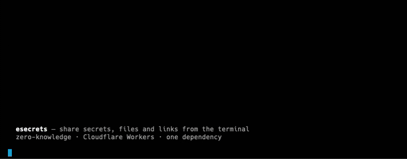
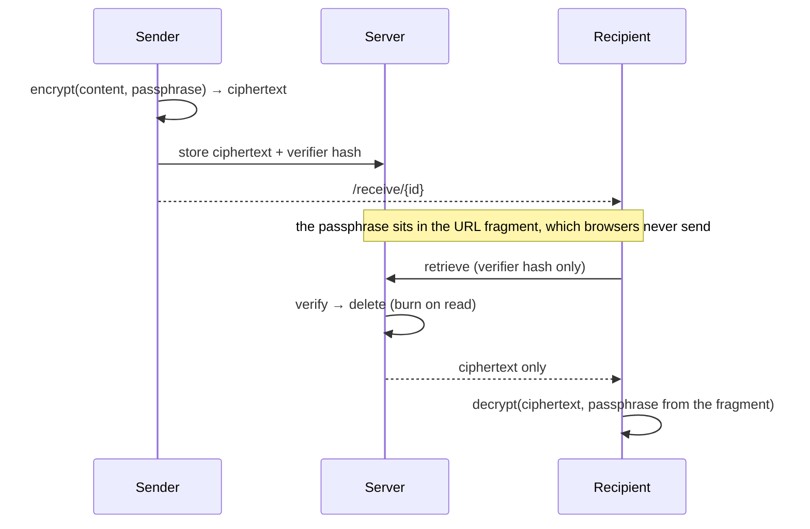
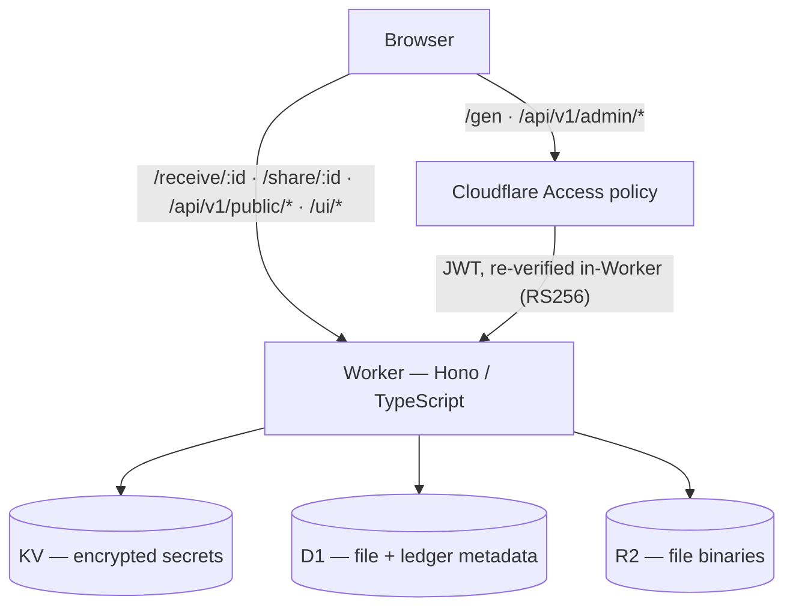

# Edge Secrets

Self-hosted, zero-knowledge sharing of passwords, files and links, running
entirely on Cloudflare Workers.


Paste a credential, get a link, send it. The recipient opens it once and it is
gone. Encryption happens in the browser, so the server you deployed — and
Cloudflare underneath it — only ever holds ciphertext.

**[Deploy it](docs/deployment.md)** · **[How it's secured](docs/security.md)** ·
**[Command line](docs/cli.md)** · **[API reference](docs/api.md)** ·
**[All documentation](docs/README.md)**

---

## Send it straight from your terminal

A CLI ships with the project. `esecrets put`, paste the credential, and the link
is on your clipboard — encrypted before it leaves the machine, never written to
your shell history, never left sitting in your scrollback.



```bash
npx esecrets put
```

Same encryption as the browser, same Argon2id parameters, so a secret made in
the terminal opens in the browser and the other way round. Sign-in goes through
your existing Cloudflare Access policy, as a real user — which is why the sender
ledger and revocation work from here too. **[Full guide →](docs/cli.md)**

---

## Why

Most secret-sharing tools are a VM, a database and a patching schedule. This one
is a Worker.

- **Zero-knowledge by default.** Text secrets and E2EE files are encrypted
  client-side. The passphrase lives in the URL fragment, which browsers never
  transmit. A full storage leak yields ciphertext.
- **$0 to run.** Workers, KV, D1, R2 and Cloudflare Access for up to 50 users all
  fit inside free tiers. No credit card, no infrastructure.
- **Nothing to patch.** No VM, no SSH port, no container. The runtime is
  ephemeral and managed; your only security responsibility is the application.
- **Fast everywhere.** Workers run in 300+ locations, so a recipient in Warsaw,
  Singapore or São Paulo is served from nearby. No cold starts, no load
  balancers.
- **Built for pipelines.** Everything is behind a versioned REST API, so a CI job
  can push a one-time credential authenticated by an Access service token, with
  no human in the loop.

---

## Features

| | |
|---|---|
| **Text secrets** | AES-256-GCM with Argon2id key derivation, passphrase in the URL fragment, burn-on-read. [Details →](docs/secrets.md) |
| **Masked on reveal** | The decrypted secret stays hidden until the reveal button is held. Copying works without ever showing it |
| **Device-bound secrets** | Opt-in. The link keeps working after the first read, but only from the browser or security key that opened it first. Up to 30 days. [Details →](docs/secrets.md#device-bound-secrets) |
| **Sent-secret ledger** | Each sender sees what they created, whether it was opened and how often. Scoped to the signed-in identity, so senders never see each other's. [Details →](docs/secrets.md#sent-secret-ledger-and-revocation) |
| **Revocation** | A sender can destroy any secret they created at any time. A recipient of a device-bound secret can destroy it early |
| **Password generator** | Pick the standard the target system actually demands — NIST SP 800-63B, an EFF or BIP-39 passphrase, legacy corporate rules, or a Base64 API key. Entropy stated for each. [Details →](docs/secrets.md#password-generator) |
| **File sharing** | R2-backed, optional password, download limit, server-enforced TTL. Caps default to 9 GB per file and are admin-configurable. [Details →](docs/files.md) |
| **E2EE file sharing** | Opt-in client-side encryption for files up to 150 MiB. The server stores ciphertext only. [Details →](docs/files.md#end-to-end-encrypted-mode) |
| **URL shortener** | Short links with a TTL and click limit, SSRF-safe, unbiased ID generation |
| **QR codes** | On every output link, rendered in the browser — the link is never handed to the server to be drawn |
| **Appearance editor** | Accent colour, background, brand name, tagline, logo and storage limits, persisted globally |
| **9 languages** | Auto-detected per visitor, with a flag picker. [Adding one →](docs/development.md#adding-a-language) |
| **Cloudflare Access** | Every write and admin endpoint behind an Access policy plus in-Worker RS256 JWT verification |
| **Command-line client** | `npx esecrets` — same client-side encryption, browser sign-in through Access, links copied straight to the clipboard. [Details →](docs/cli.md) |
| **REST API** | Versioned `/api/v1/`, split into an authenticated admin zone and a public zone. [Reference →](docs/api.md) |

---

## How a secret travels


```mermaid
sequenceDiagram
    participant S as Sender
    participant Server
    participant R as Recipient

    S->>S: encrypt(content, passphrase) → ciphertext
    S->>Server: store ciphertext + verifier hash
    S-->>R: /receive/{id}#passphrase

    Note over Server,R: the passphrase sits in the URL fragment, which browsers never send

    R->>Server: retrieve (verifier hash only)
    Server->>Server: verify → delete (burn on read)
    Server-->>R: ciphertext only

    R->>R: decrypt(ciphertext, passphrase from the fragment)
```

**The server knows:** encrypted bytes and a verification hash.
**The server never knows:** the content, the key, or the passphrase.

The link is therefore the credential — send it over a channel you trust. Every
other control exists to limit what happens if it goes astray: burn-on-read, a
three-attempt cap, device binding, and sender-side revocation.

---

## Getting started

```bash
git clone https://github.com/maciekaz/edge-secrets
cd edge-secrets
npm install
```

Then follow **[the deployment guide](docs/deployment.md)** — creating the
storage, applying the schema, setting three Worker secrets, and putting a
Cloudflare Access policy in front of `/gen` and `/api/v1/admin/*`. It is about
ten minutes.

There is also a one-click deploy button, but it cannot create your database or
configure Access, so it leaves most of that list to do afterwards:

[](https://deploy.workers.cloudflare.com/?url=https://github.com/maciekaz/edge-secrets)

---

## Architecture


```mermaid
flowchart TD
    Browser -->|"/gen · /api/v1/admin/*"| CFA["Cloudflare Access policy"]
    Browser -->|"/receive/:id · /share/:id · /api/v1/public/* · /ui/*"| Worker

    CFA -->|"JWT, re-verified in-Worker (RS256)"| Worker["Worker — Hono / TypeScript"]

    Worker --> KV[("KV — encrypted secrets")]
    Worker --> D1[("D1 — file + ledger metadata")]
    Worker --> R2[("R2 — file binaries")]
```

| Resource | Holds |
|---|---|
| **KV** (`SECRETS_STORE`) | Encrypted text secrets with their verifier, `algoVersion` and expiry; short links; global UI config |
| **D1** (`DB`) | File metadata, device bindings and challenges, the sent-secret ledger |
| **R2** (`BUCKET`) | File binaries and the brand logo |

Cloudflare Access needs exactly **two rules** — `/gen` and `/api/v1/admin/*`.
Everything else must stay public, or recipients cannot open what you send them.

**Stack:** Cloudflare Workers · [Hono](https://hono.dev) v4 · TypeScript (strict)
· Wrangler v4 · [hash-wasm](https://www.npmjs.com/package/hash-wasm) for Argon2id
· [qrcode-generator](https://github.com/kazuhikoarase/qrcode-generator), rendered
client-side.

---

## Security

Encryption is client-side, storage holds only ciphertext, and every release goes
through dependency, static, dynamic and secret scanning before it ships.

The full picture — threat model, cryptographic parameters, every control, and
the trade-offs that were accepted rather than hidden — is in
**[docs/security.md](docs/security.md)**.

To report a vulnerability, see [SECURITY.md](SECURITY.md).

---

## License

[MIT](LICENSE).
