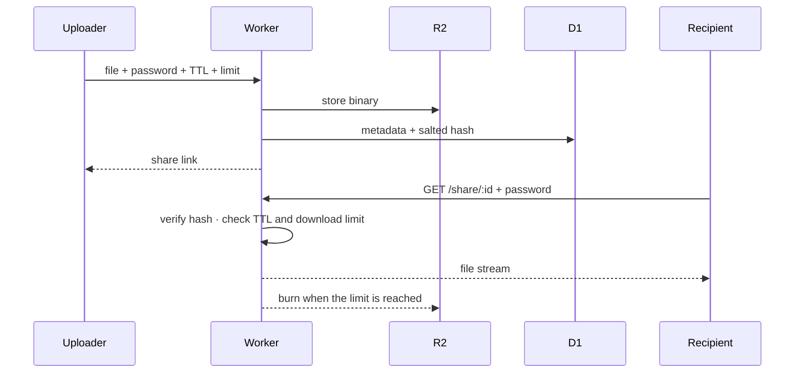
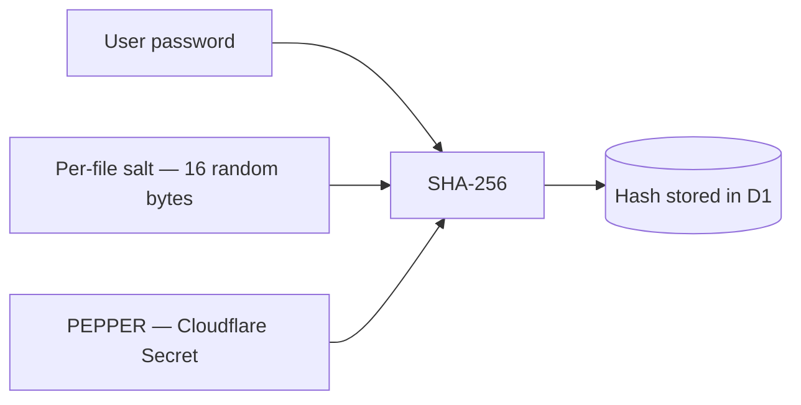
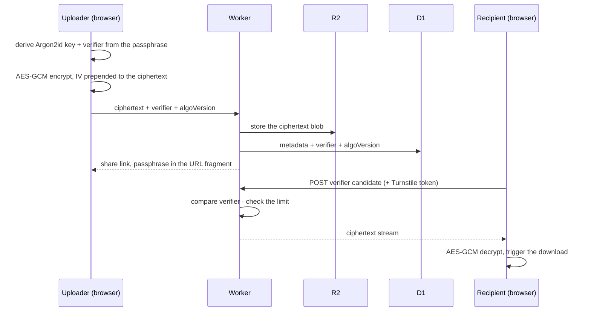

# File sharing

[← Documentation index](README.md)

Files have two independent modes, chosen per upload with a toggle on the Files
tab of the panel. The choice is a real trust decision, so it is worth making
deliberately.

| Mode | Use when | Trust model | Cap |
|---|---|---|---|
| **Normal** (default) | Automation, large files, cases where server-visible content is fine | The server can read the blob. An optional password gates retrieval | up to 50 GB |
| **End-to-end encrypted** | Content that must never sit on the server in cleartext | The browser encrypts before upload; the server holds ciphertext and a verifier, and no key material | 150 MiB |

Both modes enforce a TTL, a download limit, and destruction after three wrong
password attempts.

---

## Normal mode

- **Optional password**, hashed as `SHA-256(password | per-file salt | PEPPER)`
  and compared in constant time. Each row gets its own 16 random bytes, so
  identical passwords across files never produce the same digest and timing
  cannot leak how close a guess was.
- **Download limit** of 1, 5, or unlimited.
- **Server-enforced TTL**, 7 days maximum regardless of what the client asks
  for. Expired files are deleted by the hourly cron.
- **Lockout** after three wrong passwords deletes the file immediately. The
  counter increments atomically (`UPDATE … RETURNING`), so parallel guesses
  cannot race past the cap.
- **Size verification.** Once a multipart upload completes, the Worker re-reads
  the object's actual size and rejects the upload if it does not match what was
  declared at init — closing a declare-one-byte, upload-200-MB cap bypass.
- **Storage caps** are admin-configurable in the Appearance panel: 9 GB per file
  and 9.5 GB total by default, with a 50 GB hard ceiling on each. Any value above
  the 10 GiB R2 free tier requires typing `OKAY` to confirm.

Normal-mode passwords use a fast hash rather than Argon2id, because these
downloads are an automation path. That is an accepted trade-off — the server can
read the file either way in this mode. See
[security.md](security.md#accepted-trade-offs).

### The global pepper

`PEPPER` is a Cloudflare Secret — not in the code, not in the repository. A
database leak on its own yields hashes that cannot be attacked without it. The
Worker refuses to start when it is unset, and it must never be rotated on a live
install: every stored hash depends on it.

---

## End-to-end encrypted mode

When the uploader flips the toggle, the file never leaves the browser readable:

| Element | Algorithm | Parameters |
|---|---|---|
| Key derivation | Argon2id | m = 19 MiB, t = 2, p = 1, 32-byte output |
| Salt | file UUID for the key, UUID + `"_v"` for the verifier | 36 bytes |
| Encryption | AES-GCM | 256-bit, random 12-byte IV prepended to the blob |
| Verifier | Argon2id output, 32 bytes | stored base64, constant-time compared |

**Constraints:**

- **150 MiB hard cap.** Browser AES-GCM is one-shot, with no streaming, so
  plaintext and ciphertext must coexist in memory — roughly 300 MB peak for a
  150 MB file, which is what mid-range mobile can be relied on for.
- **The passphrase is irrecoverable.** Losing it means the file is permanently
  unreadable, and the server cannot help, because it never saw the key.
- **Independent Turnstile toggle.** `ui:turnstile_files_e2ee` can force a
  challenge on E2EE downloads without touching the normal-files toggle, which is
  often left off to keep automation working.
- **A full database and object-storage leak produces no plaintext.** The server
  holds the ciphertext, the verifier and the `algoVersion`, and nothing else.

---

## Self-service revocation

`DELETE /api/v1/public/files/:id` is intentionally outside Cloudflare Access, so
an uploader — or a script that uploaded on their behalf — can revoke a link
without an interactive login. The file UUID is the authorisation, which is
acceptable because guessing one is not a realistic attack and the automation use
case depends on it. Details in [api.md](api.md#delete-apiv1publicfilesid).

> File sharing is deliberately **shared across the account**, unlike text
> secrets. Everyone with panel access sees the same file list and storage
> statistics. If you need per-sender isolation, use text secrets.
