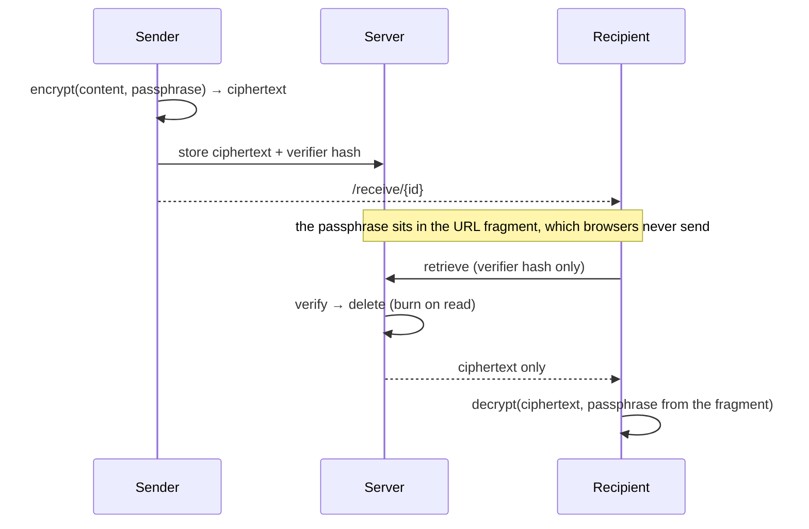
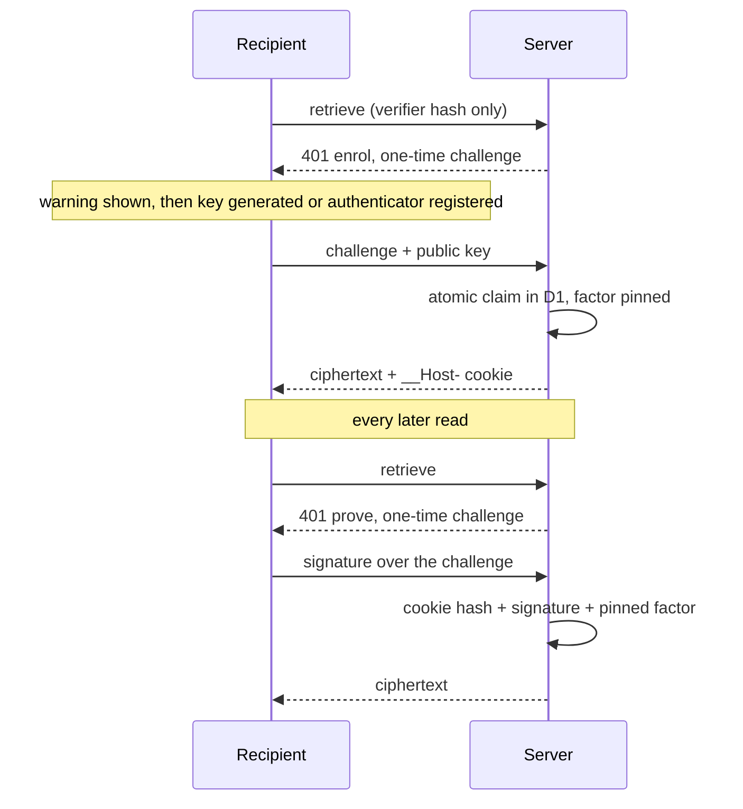
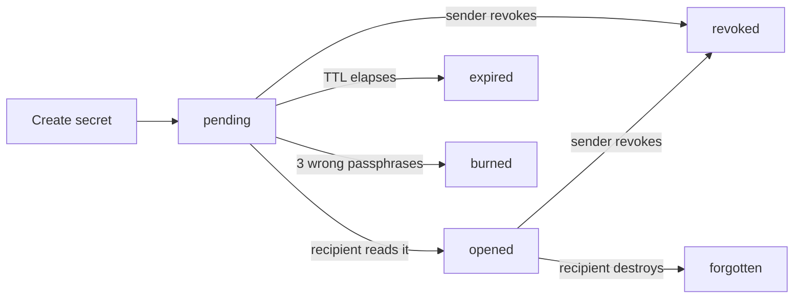

# Text secrets

[← Documentation index](README.md)

Passwords, tokens, connection strings — anything that fits in a text box.
Encryption happens entirely in the browser. The server stores ciphertext and a
verification hash, and is never in a position to read the content.

---

## How a secret travels

**The server knows:** encrypted bytes and a verification hash.
**The server never knows:** the content, the key, or the passphrase.

The consequence worth internalising is that the link is the credential. Send it
over a channel you trust, and prefer that it be a different channel from the one
carrying the context of what it unlocks.

Cryptographic parameters are in [security.md](security.md#text-secrets).

---

## On the receiving end

The retrieval page decrypts locally and then shows as little as it can get away
with:

- The secret renders **masked**. It becomes legible only while the reveal
  control is held down, so a glance over a shoulder catches nothing.
- **Copy works without revealing.** The clipboard button reads the plaintext
  directly, so the common case never puts the secret on screen at all.
- A **QR code** is one click away, for moving a credential to a phone without
  retyping it. It is drawn in the browser, so the link is never handed to the
  server to be rendered.
- If the secret is device-bound and survived its first read, a **destroy**
  control appears below a divider — red at rest, two clicks to confirm.

---

## Device-bound secrets

By default a secret dies on first read. Some need to stay reachable for days
without the link becoming a permanent liability. Setting an access mode at
creation keeps the link working, but ties it to whoever opened it first.

| Mode | Bound to | Use when |
|---|---|---|
| One-time read | nothing (default) | The secret only needs to be seen once |
| Browser | a non-extractable ECDSA key in IndexedDB | The recipient will re-open the link over days |
| Security key | a WebAuthn authenticator | The recipient is known to have a hardware key |

Both factors are required on every later read. The cookie is deliberately not
enough on its own: an infostealer that copies the cookie jar off disk defeats
`HttpOnly` entirely, so the resistance lives in the signing key, which no browser
API can export.

**Know this before enabling it:**

- Access is tied to a browser profile, not a device. A different browser on the
  same machine, or a private window, will not get in.
- Clearing cookies or site data is irreversible, by design. If the passphrase
  could restore access, anyone holding the link could restore it too.
- The ciphertext stays in storage for the secret's whole lifetime instead of
  being destroyed on first read. That extended lifetime is only safe because of
  the binding, which is why unbound secrets keep the 7-day cap and bound ones
  can run to 30 days.
- Synced passkeys (iCloud Keychain, Google Password Manager) are refused in
  security-key mode. Only device-bound credentials can bind.
- If the sender allows it, a browser that can produce no key at all falls back
  to a cookie-only binding. The first reader makes that choice once and it is
  then pinned; no later client can ask for it.

---

## Sent-secret ledger and revocation

A burn-on-read link cannot tell the sender two things they usually want to know:
whether it was ever collected, and how to pull it back if it went to the wrong
person. Both live in a collapsible section directly below the generator on the
secrets tab. Its header shows how many secrets the account has and which account
that is, so the summary is visible without expanding; the open state is
remembered between visits.

The list shows what the signed-in sender created, newest first — the identifier,
when it was made, whether it has been opened and how often, and how many wrong
passphrases were tried against it. Anything still live carries a **Revoke**
button that destroys the secret, its binding, and any outstanding challenges.
Creating a secret refreshes the list, so the link and its ledger entry appear
together.

Ownership comes from the Cloudflare Access JWT, stored as a keyed hash rather
than an address — see
[pseudonymous ownership](security.md#sender-isolation) for why, and for how
isolation between senders is enforced.

**Zero-knowledge is unaffected.** The ledger holds identifiers, timestamps and a
status. Never the verifier, the ciphertext, the passphrase or the fragment.
Knowing an identifier is enough to build a link and nothing more, because the
key never left the browser that made it.

**How long an entry stays visible.** Rows deliberately outlive the secret. A
ledger entry is kept for **7 days after the secret's own expiry**, so a sender
can still see that nobody ever collected something, and the hourly cron then
removes it. Secrets created before this feature shipped, or created by a service
token, carry no owner and appear on nobody's list.

Recipients get the mirror of this. A device-bound secret that survives its first
read shows a destroy control, so the holder can end access when they are done
rather than waiting out the window. Destroying requires clearing the same gates
a read does — the binding cookie plus a signature over a fresh challenge — which
is the difference between an emergency control and a denial-of-service hole.

---

## Password generator

The generator beside the secret field offers the format the receiving system
actually demands, rather than one compromise shape for every case.

| Standard | Output | Entropy |
|---|---|---|
| NIST SP 800-63B | 20 characters, no forced symbol classes | 117 bits |
| Memorable, EFF Long Wordlist | 6 words joined by hyphens | 77 bits |
| Memorable, BIP-39 English | 12 words joined by hyphens | 132 bits |
| Legacy corporate | exactly 12 characters, one of each class, symbol from `!@#$%^&*` | 64 bits |
| API key | 32 or 64 random bytes, Base64 | 256 / 512 bits |

Every figure is a floor, never a flattering upper bound. In the legacy mode
especially, counting all twelve characters as freely chosen would overstate it by
around nine bits, because four are drawn from small class-specific alphabets;
the shuffle that hides their positions is not credited either, since its
permutations overlap.

### Wordlists

The passphrase modes use published lists rather than anything home-grown:

| List | Words | Bits/word | Source |
|---|---|---|---|
| EFF Long Wordlist | 7776 | 12.925 | [eff.org](https://www.eff.org/files/2016/07/18/eff_large_wordlist.txt) |
| BIP-39 English | 2048 | 11 | [bitcoin/bips](https://github.com/bitcoin/bips/blob/master/bip-0039/english.txt) |

BIP-39 ships byte-identical to the standard, `sha256
2f5eed53a4727b4bf8880d8f3f199efc90e58503646d9ff8eff3a2ed3b24dbda`. The EFF file
is published as `<dice code>\t<word>` per line; only the second column is kept,
since selection comes from the CSPRNG rather than from five dice, and the codes
would cost 18 KB on the wire for data the generator never reads. Reproduce it
with `cut -f2` over the published file (`sha256
addd35536511597a02fa0a9ff1e5284677b8883b83e986e43f15a3db996b903e`).

Four EFF entries contain a hyphen themselves — `t-shirt`, `yo-yo`, `drop-down`,
`felt-tip` — so a six-word phrase can show more than five separators. Cosmetic
only: the entropy is one of 7776 per word either way.

The BIP-39 mode draws twelve words, the seed-phrase convention the list is known
for. These are twelve uniform draws and therefore 132 bits, **not a valid BIP-39
seed phrase**, where the last word carries a checksum and the entropy is 128
bits. Nothing produced here is meant to be restored into a wallet.

### Randomness and cost

Every mode draws from `crypto.getRandomValues`, never `Math.random`, and the
server is never told what was generated. Selection is unbiased in both lists:
BIP-39 is exactly 2^11 entries, and EFF is not a power of two, so draws beyond
the largest whole multiple of 7776 are rejected and redrawn rather than folded in
with a modulo.

Each list is bundled into the Worker as a string constant, so serving it costs no
storage read, and each has its own immutable, year-cached URL fetched only when
someone selects that standard. Picking one never downloads the other, and a
recipient opening `/receive/:id` downloads neither. On the wire: 24 KB for EFF,
6 KB for BIP-39, once per browser per year.
